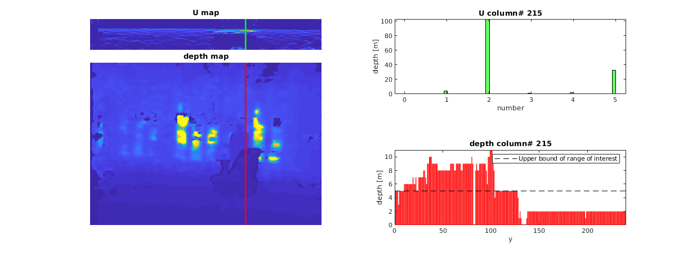
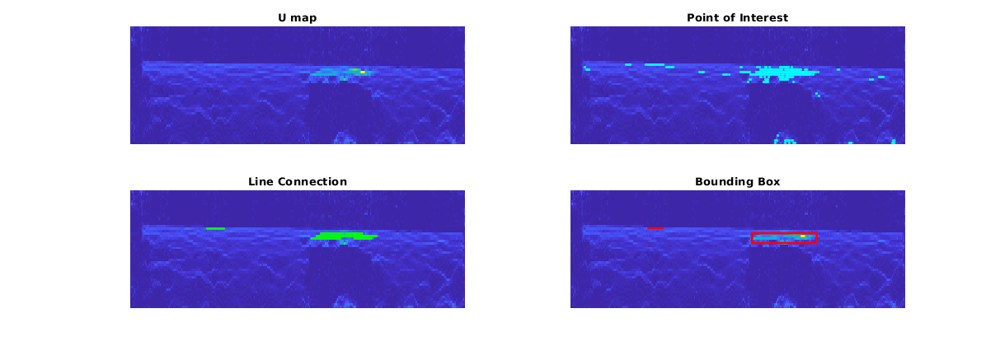

~Jiahao~
# Depending Libs
OpenCV
Eigen
# Obstacle Detection with U Map
An effective obstacle detection method takes the depth(or disparity) map as input and outputs bounding boxes of obstacles in view. Following is the short introduction of this method, which includes U map generation and obstacle clustering.

### U Map Generation
The main idea of this method is detecting the vertical obstacle via U map, which is generated by calculating the histogram of each column in the depth map. For example, in the figure below, the vector depth column #215 (red line) is used to calculate the U map column #215 (green line). The two bar diagrams on the right contains the depth vector and U vector respectively.
<table align="center"><tr><td align="center" width="9999">

</td></tr></table>

Note that we defined the range of interest for two reasons: to filter out background (such as wall), which might be detected as large obstacles and cost lot of computation; we will only use the obstacle information for short-term obstacle's prediction.

After U map generation, as suggested by [2][2], we then smooth the U map with 2D Gaussian convolution. This step can certainly ensure the clustering performance.

### Obstacle Clustering
The depth of an obstacle will accumulate in a histogram bin, for example in the figure above, column #215 intersects with the chair in view, most of the data fall into the bins at around 2 meters. With this information, we know the distance between the camera and the obstacle and its direction. However, we also interest in the size of the obstacle in order to perform obstacles' motion prediction in the future stage. Thus, an effective obstacle clustering technique is needed.

The used method simply iterates all points in the U map. We first set a thershold to filter out uninterest points, as suggested by the author of [1][1], we firstly only keep the point whose value is larger than 10% of the maximum value. However, we found that when an obstacle is much close than another, only the closer one can be detected. Thus,we modified the threshold as:
```Matlab
threshold = 0.2 * downsample;
```

where the downsample is the ratio between depth map's height and U map's height.

The second step is connecting all the contiguous candidate points horizontally. For this part, two selecting criteria are used: the line should be longer than a thershold value (we use 15 in our experiments); the sum of the line's pixel value should be larger than 200% of its maximumal pixel value (as suggested by [1][1]). Lines that close to each others are then grouped as a cluster. We then extracted the 2D bounding box by simply extracting the top-left and bottom-right points of each group.

Note that the final bounding box is lightly different with the extracted one, because only the front face of the obstacle is detected, the final bounding box's depth is two times of the extracted one's.

The pipeline of this part can be concluded as: extract the point of interest; connect points into lines; group lines and extract bounding box. For the sake of clearness, an example is shown in the figure below.
<table align="center"><tr><td align="center" width="9999">

</td></tr></table>

### Result and Future Work
We test our re-implementation with two datasets captured by ourselves. The camera is fixed in the first dataset and moved in the second. For the first experiment, the obstacle's information in 2D is extracted nicely.
<table align="center"><tr><td align="center" width="9999">

</td></tr></table>

However in the second one, the detection of large surfaces is detrimental to the real-time performance.
<table align="center"><tr><td align="center" width="9999">

</td></tr></table>

As can be seen from the result, there are some false positive detections. We will seek some techniques to filter them out from the consequential depth map.

### Reference
[1]: http://people.inf.ethz.ch/pomarc/pubs/OleynikovaICRA15.pdf  "Reactive Avoidance Using Embedded Stereo Vision for MAV Flight"

[Reactive Avoidance Using Embedded Stereo Vision for MAV Flight](http://people.inf.ethz.ch/pomarc/pubs/OleynikovaICRA15.pdf)

[2]: https://www.vision.rwth-aachen.de/media/papers/jafari14icra_realtime_rgbd_tracking.pdf  "Real-Time RGB-D based People Detection and Tracking for Mobile Robots and Head-Worn Cameras"

[Real-Time RGB-D based People Detection and Tracking for Mobile Robots and Head-Worn Cameras]( https://www.vision.rwth-aachen.de/media/papers/jafari14icra_realtime_rgbd_tracking.pdf)

